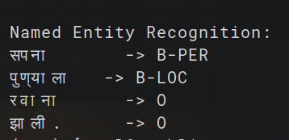

# 🔤 Marathi Named Entity Recognition (NER)

> A custom NER system trained on annotated Marathi data using Conditional Random Fields (CRF).  
> This project is part of the broader **NLP-Research-Lab** initiative to build core NLP tools from scratch for Indian languages.

---

## 🚀 Overview

Named Entity Recognition (NER) is a foundational NLP task to identify entities like **persons**, **locations**, and **organizations** in text. This repository implements a simple NER model for **Marathi** using a small, custom-annotated dataset.

- ✍️ Manual annotation of training data
- 📊 CRF-based model training
- ✅ Tested on Marathi sentences
- 📄 Easily extensible for more entity types

---

## 🧠 Methodology

1. **Data Annotation**  
   Sentences manually tagged using `BIO` format (`B-PER`, `B-LOC`, etc.)

2. **Feature Engineering**  
   - Character n-grams  
   - Word position  
   - Suffix analysis  
   - Context words  

3. **Model Training**  
   - Conditional Random Fields (via `sklearn-crfsuite`)  
   - Evaluated on token-wise predictions

4. **Testing**  
   Simple test interface to visualize predicted NER tags.

---

## 💻 Technologies Used

| Component       | Tool/Library         |
|----------------|----------------------|
| Language        | Marathi              |
| Model           | CRF (`sklearn-crfsuite`) |
| Language        | Python 3.x           |
| Annotation Format | BIO Tagging        |
| Visualization   | Terminal Output + PNG |

---

## 📸 Sample Output

A snapshot of the model in action:

<p align="center">
  
</p>

---

## 📂 Repository Structure

```bash
Marathi-NER/
│
├── train.py              # Training script
├── test.py               # Testing script
├── features.py           # Feature extraction
├── utils.py              # Helper functions
├── marathi_ner_crf.model # Trained model
├── dataset.txt           # Annotated dataset
├── marathi_NER.png       # Output image
└── README.md             # This file
```

--- 

## 🔮 Future Work

- 📈 **Expand Dataset**: Add more annotated Marathi data to improve the model’s accuracy and entity coverage.
- 🌐 **Web UI**: Build an interactive web interface for real-time Marathi NER tagging and visualization.

---

## 👨‍🔬 Author Note

- This project is part of my broader NLP research initiative focused on building tools for underrepresented Indian languages — without relying on pre-trained models.
- If you're working on **Marathi NLP** and need raw data, I’ve also curated a **non-annotated Marathi text dataset**, scraped from a Marathi news website. It can be used for tasks like language modeling, text classification, or even custom NER training.

📬 **Interested in the dataset?** Feel free to [**email me directly**](mailto:deshpandeatul05gmail.com) to get access!
